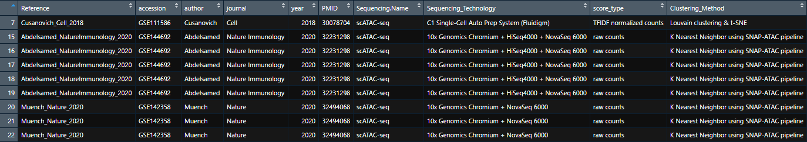

# scATAC.Explorer

## Introduction

scATAC-Explorer is a curated collection of publicly available scATAC-seq (Single Cell Assay for Transposase-Accessible Chromatin using sequencing) datasets. It aims to provide a single point of entry for users looking to study chromatin accessibility at the single-cell level. 

Users can quickly search available datasets using the metadata table, and then download the datasets they are interested in for analysis. Optionally, users can save the datasets for use in applications other than R. 

This package will improve the ease of studying and integrating scATAC-seq datasets. Developers may use this package to obtain data for analysis of multiple tissues, diseases, cell types, or developmental stages. It can also be used to obtain data for validation of new algorithms. 


## Installation
``` 
if (!requireNamespace("BiocManager", quietly = TRUE))
    install.packages("BiocManager")
BiocManager::install("SingleCellExperiment")
library(devtools)
install_github("shooshtarilab/scATAC.Explorer")
```

# Tutorial

## Exploring available datasets

Start by exploring the available datasets through metadata.

```
> res = queryATAC(metadata_only = TRUE)
```

This will return a list containing a single dataframe of metadata for all available datasets. View the metadata with `View(res[[1]])` and then check `?queryATAC` for a description of searchable fields. Due to some datasets being gathered from different organisims or experimental conditions, some datasets contain multiple data matrices. These are represented as seperate objects where each can be differentiated by the "Data_Summary" and "matrix_names" field in the metadata, which specify the contents of each matrix.

Note: in order to keep the function's interface consistent, `queryATAC` always returns a list of objects, even if there is only one object. You may prefer running `res = queryATAC(metadata_only = TRUE)[[1]]` in order to save the dataframe directly.


The `metatadata_only` argument can be applied alongside any other argument in order to examine only datasets that have certain qualities. You can, for instance, view only leukemia datasets by using 

```
> res = queryATAC(disease = 'leukemia', metadata_only = TRUE)[[1]]
```


| Search Parameter | Description                                     | Examples                |
| ---------------- | ----------------------------------------------- | ----------------------- |
| geo_accession    | Search by GEO accession number                  | GSE129785, GSE89362     |
| has_cell_types   | Filter by presence of cell-type annotations     | TRUE, FALSE             |
| has_clusters     | Filter by presence of cluster results           | TRUE, FALSE             |
| disease          | Search by disease                               | Carcinoma, Leukemia     |
| author           | Search by first author                          | Satpathy, Cusanovich    |
| journal          | Search by publication journal                   | Science, Nature, Cell   |
| year             | Search by year of publication                   | <2015, >2015, 2013-2015 |
| pmid             | Search by PubMed ID                             | 27526324, 32494068      |
| sequence_tech    | Search by sequencing technology                 | 10x Genomics Chromium   |
| organism         | Search by source organism                       | Mus musculus            |
| sparse           | Return expression in sparse matrices            | TRUE, FALSE             |

#### Searching by year

In order to search by single years and a range of years, the package looks for specific patterns. '2013-2015' will search for datasets published between 2013 and 2015, inclusive. '<2015' will search for datasets published before or in 2015. '>2015' will search for datasets published in or after 2015.


### Getting your first dataset

Once you've found a field to search on, you can get your data. 

```
> res = queryATAC(geo_accession = "GSE89362")
```

This will return a list containing dataset GSE89362. The dataset is stored as a `SingleCellExperiment` object, with the following metadata list:

#### Metadata
| Attribute     | Description |
| ------------- | --------------------------------------------------------------- |
| cells         | A list of cells included in the study |
| regions       | A list of genomic regions (peaks) included in the study |
| pmid          | The PubMed ID of the study |
| technology    | The sequencing technology used |
| genome_build  | The genome build used for data generation |
| score_type    | The type of scoring or normalization used on the counts data |
| organism      | The type of organism from which cells were sequenced |
| author        | The first author of the paper presenting the data |
| disease       | The diseases sampled cells were sampled from |
| summary       | A broad summary of the study conditions the sample was assayed from |
| geo_accession | The GEO accession ID for the dataset |

#### Accessing data

To access the sequencing data (a peak-by-cell counts matrix), use the counts() function. _Note: In the example image, a subset of the first 8 rows and columns of matrix were selected for demonstration purposes._
```
> counts(res[[1]])
```


Cell type labels and/or cluster assignments are stored under `colData(res[[1]])` for datasets where cell type and/or cluster labels are available.

To access metadata for the first dataset in a query result, use
```
> metadata(res[[1]])
```
Specific metadata entries can be accessed by specifying the attribute name, for instance
```
> metadata(res[[1]])$pmid
```

### Example: Working with datasets containing cell type labels
Say you want to compare chromatin accessibility between different cell types. To do this, you need datasets that have cell-types labels available. First you will need to query scATAC.Explorer to find any datasets containing your cell types of interest. This can be done by searching using the both the _has_cell_type_ and _metadata_only_ parameters.  
```
> res = queryATAC(has_cell_type = TRUE, metadata_only = TRUE)
> View(res[[1]])
```


This will return a list of metadata for all datasets that have cell-type annotations available. We can see there is a dataset with 5 matrices, GSE144692, that contains cell type data. By examining the _Data_Summary_ and _matrix_names_ field of the metadata, we can see each matrix contains cells isolated from Type 1 Diabetes patients. :

```
> res = queryATAC(geo_accession = "GSE144692", metadata_only = TRUE)
> View(res[[1]])
```


For each SingleCellExperiment object returned, cell label or clustering annotations are also stored within the object. This can be accessed by using _colData()_  
```
> res = queryATAC(geo_accession = "GSE144692")
> colData(res[[1]])
```


The rownames of this dataframe contains the cell barcode or cell ID, the second contains the cell type, and the third contains the cluster assignment if available. Any dataset with either cell type or clustering annotations will have this _colData_ available.

### Example: Using returned datasets with scATAC-seq analysis pipelines
Analysis pipelines are commonly used in research for working with scATAC-seq data. Many of these pipelines have been created as packages for R. Not every pipeline uses the SingleCellExperiment object as an input, such as the commonly used R toolkit Seurat (more info at https://satijalab.org/seurat/), extended for scATAC-seq analysis by Signac (more info at https://satijalab.org/signac/index.html). Seurat is a R package commonly used for both scRNA-seq and scATAC-seq analysis. Datasets from scATAC.Explorer can be easily converted to Seurat objects : 

Datasets retrieved using scATAC.Explorer can easily be converted to Seurat objects :
```
library(Seurat)
library(Signac)
> res = queryATAC(geo_accession = "GSE89362")
> GSE89362_assay <- CreateChromatinAssay(counts = counts(res[[1]]), sep = c("-", "-"))
> GSE89362_obj <- CreateSeuratObject(counts = GSE89362_assay , assay = "peaks")
> GSE89362_obj
```


## Saving Data

To facilitate the use of any or all datasets outside of R, you can use `saveATAC()`. `saveATAC` takes two parameters, one a `ATAC_data` object to be saved, and the other the directory you would like data to be saved in. Note that the output directory should not already exist.

To save the data from the earlier example to disk, use the following commands.

```
> res = queryATAC(geo_accession = "GSE89362")[[1]]
> saveATAC(res, './Output')
[1] "Done! Check ./Output for file"
```
Three files will always be saved: a counts .mtx file, a peak region .tsv file, and a cell ID/Barcodes .tsv file. This format is following the Market Matrix format that can be used in other programs. If the SingleCellExperiment contained cell type or cell cluster annotations in it's _colData_, a csv file will be generated containing the annotations.


## System Requirements

While many of the datasets included in this package are small enough to be loaded and stored, even as dense matrices, on machines with an 'average' amount of memory (8-32gb), there are a few larger datasets that will take up a significant amount of this memory individually. With this in mind, we recommend always using `sparse = TRUE` when possible and using a system with at least 64gb of RAM for full functionality.

If you have 8-16gb of memory, or are encountering crashes due to memory limitations, try grabbing datasets individually using the `accession` parameter.
