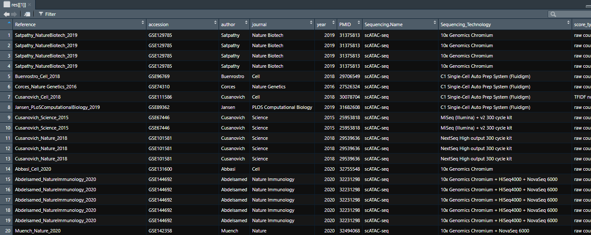
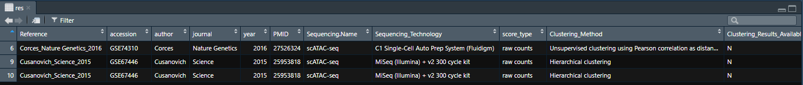
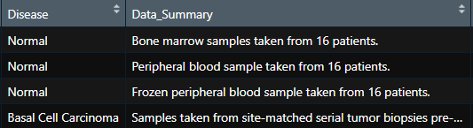
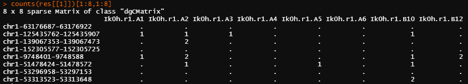
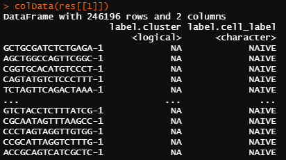
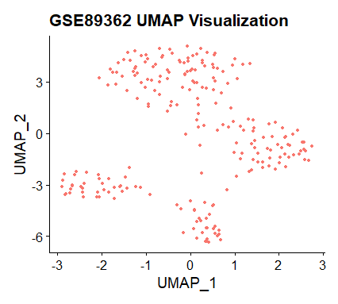
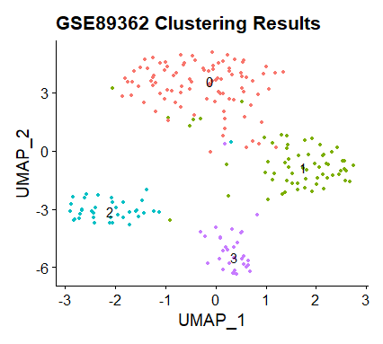
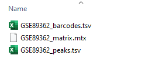

# scATAC.Explorer

## Introduction

scATAC-Explorer is a curated collection of publicly available scATAC-seq (Single Cell Assay for Transposase-Accessible Chromatin using sequencing) datasets. It aims to provide a single point of entry for users looking to study chromatin accessibility at the single-cell level. No standard format for scATAC-seq data exists, so by accessing datasets using scATAC.Explorer, a consistent format is available to users to easily retrieve and integrate multiple datasets together with.

Users can quickly search publicly available datasets using the metadata table, and then download the datasets they are interested in for analysis. Optionally, users can save the datasets for use in applications other than R.

This package will improve the ease of studying and integrating scATAC-seq datasets. Developers may use this package to obtain data for analysis of multiple tissues, diseases, cell types, or developmental stages. It can also be used to obtain data for validation of new algorithms.

## Installation

Please note: Your R version should be 4.0.5 or higher. Any dependent packages should be updated to ensure compatibility.

```R
if (!requireNamespace("BiocManager", quietly = TRUE))
    install.packages("BiocManager")
BiocManager::install("SingleCellExperiment")
library(devtools)
install_github("shooshtarilab/scATAC.Explorer")
```

## Dependencies

R package dependencies for scATAC.Explorer include

```R
  SingleCellExperiment,
  BiocFileCache,
  data.table,
  utils,
  S4Vectors
```

# Tutorial

## Exploring available datasets

Start by exploring the available datasets through metadata. An online version of the metadata table can be viewed at https://shooshtarilab.github.io/scATAC.Explorer.

```R
library(scATAC.Explorer)
res = queryATAC(metadata_only = TRUE)
```

This will return a list containing a single dataframe of metadata for all available datasets. View the metadata with `View(res[[1]])` and then check `?queryATAC` for a description of searchable fields.

Note: in order to keep the function's interface consistent, `queryATAC` always returns a list of objects, even if there is only one object. You may prefer running `res = queryATAC(metadata_only = TRUE)[[1]]` in order to save the dataframe directly.



The `metatadata_only` argument can be applied alongside any other argument in order to examine just the metadata of matching datasets. You can, for instance, view only leukemia datasets by using:

```R
res = queryATAC(disease = "leukemia", metadata_only = TRUE)[[1]]
View(res)
```

There are many parameters available to search for datasets. Below is an example of some of the available parameters that can be searched by.



| Search Parameter    | Description                                         | Examples                    |
| ------------------- | --------------------------------------------------- | --------------------------- |
| accession           | Search by unique accession number or ID             | GSE129785, GSE89362         |
| has_cell_types      | Filter by presence of cell-type annotations         | TRUE, FALSE                 |
| has_clusters        | Filter by presence of cluster results               | TRUE, FALSE                 |
| disease             | Search by disease                                   | Carcinoma, Leukemia         |
| broad_cell_category | Search by broad cell cateogries present in datasets | Neuronal, Immune            |
| tissue_cell_type    | Search by tissue or cell type when available        | PBMC, glia, cerebral cortex |
| author              | Search by first author                              | Satpathy, Cusanovich        |
| journal             | Search by publication journal                       | Science, Nature, Cell       |
| year                | Search by year of publication                       | <2015, >2015, 2013-2015     |
| pmid                | Search by PubMed ID                                 | 27526324, 32494068          |
| sequence_tech       | Search by sequencing technology                     | 10x Genomics Chromium       |
| organism            | Search by source organism                           | Mus musculus                |
| genome_build        | Search by genome build                              | hg19, hg38, mm10            |
| sparse              | Return expression in sparse matrices                | TRUE, FALSE                 |

#### Searching by year

In order to search by single years and a range of years, the package looks for specific patterns. '2013-2015' will search for datasets published between 2013 and 2015, inclusive. '<2015' will search for datasets published before or in 2015. '>2015' will search for datasets published in or after 2015.

### Getting your first dataset

Once you've found a field to search on, and have identified dataset(s) you are interested in, you can retrive their data. By querying without specifying the *metadata_only* parameter to TRUE, the data for the matching dataset(s) will be returned. In our first example we will retrieve a single dataset. This can be done by searching its unique accession ID.

```R
res = queryATAC(accession = "GSE89362")
```

This will return a named list containing all datasets that are found by the query. In this case the list contains only dataset GSE89362. The dataset is stored as a `SingleCellExperiment` object. The object contains the peak-by-cell counts matrix, as well as metadata for the dataset, including:

#### Metadata

| Attribute    | Description                                                         |
| ------------ | ------------------------------------------------------------------- |
| cells        | A list of cell names included in the data                           |
| regions      | A list of genomic regions (peaks) included in the data              |
| pmid         | The PubMed ID of the study                                          |
| technology   | The sequencing technology used                                      |
| genome_build | The genome build used for data generation                           |
| score_type   | The type of scoring or normalization used on the counts data        |
| organism     | The type of organism from which cells were sequenced                |
| author       | The first author of the paper presenting the data                   |
| disease      | The diseases cells were sampled from                                |
| summary      | A broad summary of the study conditions the sample was assayed from |
| accession    | The GEO accession ID for the dataset                                |

#### Datasets represented by multiple matrices

Due to some datasets contain data gathered from several different organisims (such as both mice and human) or experimental conditions, some datasets are represtented by several entries with the same reference and accession, but containing different data. The *Data_Summary* and *matrix_names* field in the returned metadata table specify the contents of datasets with multiple entries. An example is given below:

This study collected data relating to carcinoma and PBMC data was retrieved by using *queryATAC(accession = "GSE129785", metadata_only = TRUE)* to initially see just metadata associated with the study. As shown in the metadata_only results table below, there are 4 entries for data from one study, meaning there are 4 matrices of scATAC-seq data associated with this study.


By examining the *Disease* and *Data_Summary* fields of the *metadata_only = TRUE* results, we can see that each object that will be returned represents a different tissue sample, some being healthy bone marrow samples, or others being basal cell carcinoma tumor biopsies. This data summary is also attached to each SingleCellExperiment object when entire datasets are downloaded.



#### Accessing data

To access the sequencing data (a peak-by-cell counts matrix), use the *counts()* function. Rows of the peak-by-cell matrix correspond to genomic regions (in the format of chromsome-start-end) that presented chromatin accessibility peaks, or pre-defined binned windows in the genome. Each column of the matrix represents a cell (named by the unique cell ID or cell barcode). Individual reads within the matrix specify whether accessibile chromatin was detected within the cell (0 if none detected, which is stored as a "." in sparse matrices). _Note: In the example image, a subset of the first 8 rows and columns of matrix were selected for demonstration purposes._

```R
counts(res[[1]])
```



Cell type labels and/or cluster assignments are stored under `colData(res[[1]])` for datasets where cell type and/or cluster labels are available.

As shown below, there can be multiple matrices returned by one query. Each item in the list is named to help differentiate them from one another, and can be selected by using res[[1]], res[[2]] and so on, or can be iterated over. Below is an example of a single dataset (GSE67446) that has two matrices associated with it, shown using *View(res)*.


To access metadata for the first dataset in a query result, use

```R
metadata(res[[1]])
```

Specific metadata entries can be accessed by specifying the attribute name, for instance

```R
metadata(res[[1]])$pmid
```


### Example: Working with datasets containing cell type labels

Say you want to compare chromatin accessibility between different cell types. To do this, you need datasets that have cell-types labels available. First you will need to query scATAC.Explorer to find any datasets containing your cell types of interest. This can be done by searching using the both the _has_cell_type_ and _metadata_only_ parameters.  

```R
res = queryATAC(has_cell_type_annotation = TRUE, metadata_only = TRUE)
View(res[[1]])

```


This will return a list of metadata for all datasets that have cell-type annotations available. We can see there is a dataset with 5 matrices, GSE144692, that contains cell type data. By examining the _Data_Summary_ and _matrix_names_ field of the metadata, we can see each matrix contains cells isolated from Type 1 Diabetes patients. :

```R
res = queryATAC(accession = "GSE144692", metadata_only = TRUE)
View(res[[1]])
```


For each SingleCellExperiment object returned, cell label or clustering annotations are also stored within the object. This can be accessed by using _colData()_  

```R
res = queryATAC(accession = "GSE144692")
colData(res[[1]])
```



The rownames of this dataframe contains the cell barcode or cell ID, the second contains the cell type, and the third contains the cluster assignment if available. Any dataset with either cell type or clustering annotations will have this _colData_ available.

### Example: Using returned datasets with scATAC-seq analysis pipelines

Analysis pipelines are commonly used in research for working with scATAC-seq data. Many of these pipelines have been created as packages for R. Not every pipeline uses the SingleCellExperiment object as an input, such as the commonly used R toolkit Seurat (more info at <https://satijalab.org/seurat/>), extended for scATAC-seq analysis by Signac (more info at <https://satijalab.org/signac/index.html>). Seurat is a R package commonly used for both scRNA-seq and scATAC-seq analysis.

Datasets retrieved using scATAC.Explorer can easily be converted to Seurat objects:

```R
library(Seurat)
library(Signac)
# GSE89362 is used as an example, as it is the smallest dataset included within scATAC.Explorer
res = queryATAC(accession = "GSE89362")
GSE89362_assay <- CreateChromatinAssay(counts = counts(res[[1]]), sep = c("-", "-"))
GSE89362_obj <- CreateSeuratObject(counts = GSE89362_assay , assay = "peaks")
GSE89362_obj
```


Once converted to a Seurat object, functions from Signac can be used to preform further analysis. A quick example of this is shown by generating UMAP projections and clustering of cells retrieved from GSE89362.

```R
library(ggplot2)
# these three function below preform Latent Semantic Indexing (LSI), neccessary for Seurat UMAP projection and clustering
GSE89362_obj <- RunTFIDF(GSE89362_obj)
# setting cutoff to be top 100% so every feature gets a percentile rank assigned to it
GSE89362_obj <- FindTopFeatures(GSE89362_obj, min.cutoff = "q0")
GSE89362_obj <- RunSVD(GSE89362_obj)

# generates a correlation plot between sequencing depth and LSI components. By observing the plot we can see the first LSI component is highly correlated with sequencing depth.
# due to this, the first dimension of the LSI component will not be used in further analysis as a quality control step.
DepthCor(GSE89362_obj)

# run UMAP reduction, excluding the LSI first dimension as we are 
GSE89362_obj <- RunUMAP(GSE89362_obj, dims = 2:30, reduction = 'lsi')

# plotting UMAP
UMAP.plt <- DimPlot(GSE89362_obj, reduction = "umap") + 
    labs(title = "GSE89362 UMAP Visualization") +
    theme(legend.position="none")
UMAP.plt

# clustering first by finding neighbours
GSE89362_obj <- FindNeighbors(
    object = GSE89362_obj,
    reduction = 'lsi',
    dims = 2:30
)

# finding and creating cluster annotations
# algorithm 1 = Louvain clustering algorithm
GSE89362_obj <- FindClusters(
    object = GSE89362_obj,
    resolution = 1.1,
    algorithm = 1,
    verbose = FALSE
)
# generating UMAP plot with cluster assignments
cluster.plt <- DimPlot(object = GSE89362_obj, label = TRUE) + NoLegend()
cluster.plt
```




## Saving Data

Many of the included scATAC-seq datasets are quite large downloads. To prevent having to repeatedly download a query every time you want to work with a particular set of datasets, you can save a query to disk using the R function `saveRDS()`, then read it back into R later using `readRDS()`. Below is an example of this functionality

```R
res = queryATAC(accession = "GSE89362")[[1]]
saveRDS(res, './queryResult.rds') # saving as R object as file

res = loadRDS('./queryResult.rds') # loading R object from file
```

## Exporting Data

To facilitate the use of any or all datasets outside of R, you can use `saveATAC()`. `saveATAC` takes two parameters, one a `ATAC_data` object to be exported, and the other the directory you would like data to be saved in. Note that the output directory should not already exist.

To export the data from the earlier example to disk, use the following commands.

```R
res = queryATAC(accession = "GSE89362")[[1]]
saveATAC(res, './Output')
[1] "Done! Check ./Output for file"
```

Three files will always be saved: a counts .mtx file, a peak region .tsv file, and a cell ID/Barcodes .tsv file. This format is following the Market Matrix format that can be used in other programs. If the SingleCellExperiment contained cell type or cell cluster annotations in it's _colData_, a csv file will be generated containing the annotations.



## System Requirements

While many of the datasets included in this package are small enough to be loaded and stored, even as dense matrices, on machines with an 'average' amount of memory (8-32gb), there are a few larger datasets that will take up a significant amount of this memory individually. With this in mind, we recommend always using `sparse = TRUE` when possible and using a system with at least 64gb of RAM for full functionality.

If you have 8-16gb of memory, or are encountering crashes due to memory limitations, try grabbing datasets individually using the `accession` parameter.
